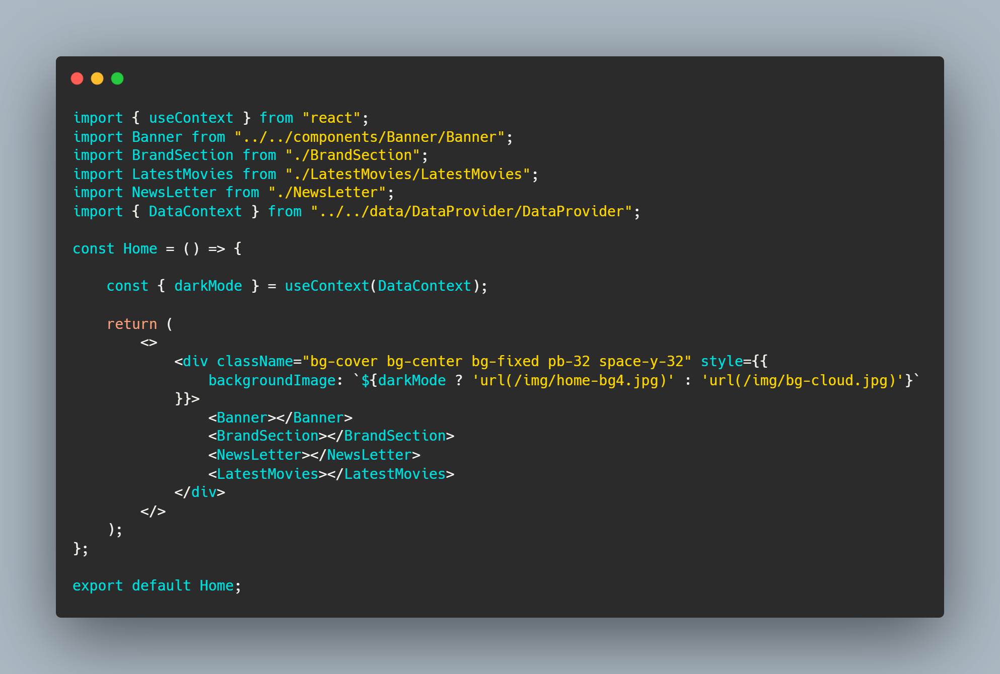

# Midnight Tales

Welcome to Midnight Tales, your ultimate destination for entertainment and media. This MERN (MongoDB, Express.js, React, Node.js) stack-based website offers a unique and immersive experience for both users and developers.

## Live Website

Explore Midnight Tales on our [live website](https://midnight-tales-32469.web.app).

## Project Overview

Midnight Tales is a brand-based website where we have brought together seven distinct categories from the world of entertainment and media. Users can explore various brands, products, and related information in a seamless and visually appealing interface.

## Key Features

1. **Unique Design**: Our website stands out with a one-of-a-kind design that ensures a memorable user experience.

2. **Navigation**: The user-friendly navigation menu includes options like Home, Add Product, My Cart, and Login. Plus, the website name and logo are prominently displayed.

3. **Brand Selection**: Users can choose from seven different categories, including Technology and Electronics, Automotive, Fashion and Apparel, Food and Beverage, Retail and E-commerce, Entertainment and Media, and Cosmetics and Beauty.

4. **Add Product**: A secure private route allows users to add products effortlessly. The form includes essential details such as image, name, brand name, type, price, short description, and rating.

5. **Product Details**: Brands redirect users to dedicated pages where they can explore products in depth. Each brand page offers a slider with advertisements and at least four products, providing crucial product information.

6. **Product Details**: On the detailed product pages, users can find extensive information about the product. An "Add to Cart" button simplifies the purchase process.

7. **My Cart**: Users can manage their added products in the My Cart page. The feature includes the ability to remove products. The design is flexible and open to customization.

8. **Update Products**: The "Update" button allows users to access a form page for modifying product details, including image, name, brand name, type, price, and rating.

9. **Authentication**: We implement email and password-based authentication for secure user registration and login. Users can switch between login and registration views.

10. **Error Handling**: The registration and login pages include error handling for password criteria and login mismatches. Alerts and toasts are used to display error messages.

